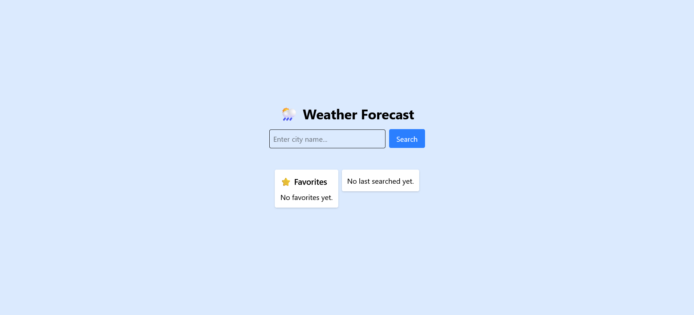
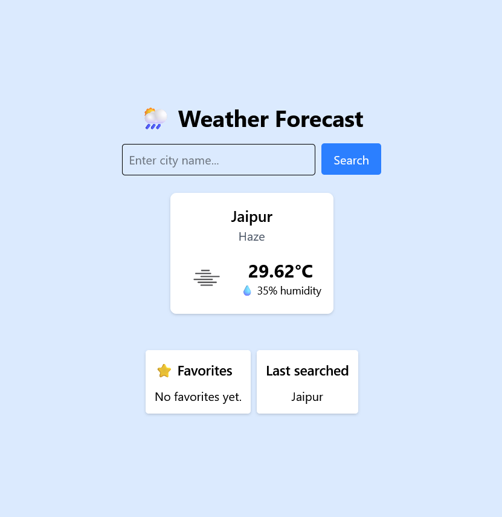
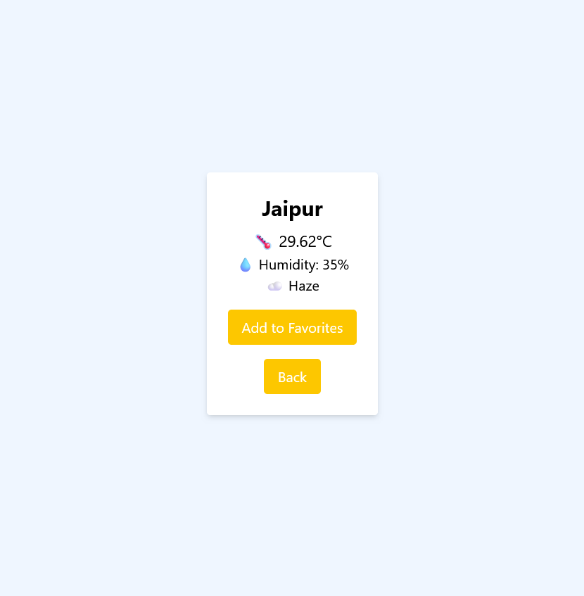

# 🌦️ Weather Forecast App

A modern, responsive weather forecast application built with **React**, **Redux Toolkit**, **Async Thunk**, **React Router**, and **TailwindCSS**, integrating the **OpenWeather API** to display real-time weather information.

Checkout the website here: [Weather App](https://boisterous-semifreddo-9383dc.netlify.app/)

---

## Table of Contents
1. [Overview](#overview)
2. [Screenshot](#screenshot)
3. [Features](#features)
4. [Tech Stack](#tech-stack)
5. [Project Structure](#project-structure)
6. [Setup & Installation](#setup--installation)
7. [Usage](#usage)
8. [Environment Variables](#environment-variables)
9. [Optimization & Enhancements](#optimization--enhancements)
10. [Deployment](#deployment)
11. [License](#license)

---

## Overview

The Weather Forecast App allows users to:

- Search for current weather by city name.
- View temperature, humidity, and weather description with icons.
- Save favorite cities for quick access.
- Store last searched city for fast navigation.
- Navigate between home page and city-specific weather page.
- Handle loading and error states efficiently.

It uses Redux Toolkit for state management and `createAsyncThunk` for async API calls, ensuring a smooth user experience.

---

## Screenshot
- **Website in desktop mode**


- **Website searched a query and showing the weather also in tab mode**


- **When a user clicked on the searched query, then it goes to other page for more datails and also in mobile screen resolution showing reponsiveness**


---

## Features

- **City Search** – Search weather by city name.
- **Weather Display** – Temperature, humidity, weather description, and icon.
- **Favorites** – Add/remove favorite cities stored in `localStorage`.
- **Last Searched** – Quick access to last searched city.
- **Routing** – Home page `/` and city page `/city/:name` using React Router.
- **Loading & Error Handling** – Async states handled with Redux Toolkit.
- **Responsive UI** – TailwindCSS cards layout.
- **Environment Variables** – `.env` for API keys.

---

## Tech Stack

| Technology | Purpose |
|------------|---------|
| React + Vite | Frontend framework and bundler |
| Redux Toolkit | State management |
| createAsyncThunk | Async API calls |
| React Router | Routing between pages |
| TailwindCSS | Styling and responsive layout |
| Axios | HTTP requests to OpenWeather API |
| dotenv | Secure storage of API keys |
| localStorage | Persisting favorites and last searched city |

---

## Project Structure

```
weather-app/
├─ public/
├─ src/
│  ├─ components/
│  │  ├─ WeatherCard.jsx
│  │  └─ Loader.jsx
│  ├─ features/
│  │  └─ weather/
│  │     ├─ weatherSlice.js
│  │     └─ weatherAPI.js
│  ├─ pages/
│  │  ├─ Home.jsx
│  │  └─ CityWeather.jsx
│  ├─ store/
│  │  └─ store.js
│  ├─ App.jsx
│  ├─ main.jsx
│  └─ index.css
├─ .env
├─ package.json
└─ tailwind.config.js
```

---

## Setup & Installation

1. **Clone the repository**

```bash
git clone <repo-url>
cd weather-app
```

2. **Install dependencies**

```bash
npm install
```

3. **Set up TailwindCSS**

```bash
npx tailwindcss init -p
```

4. **Create `.env` file**

```
VITE_WEATHER_API_KEY=your_openweather_api_key
```

5. **Run the development server**

```bash
npm run dev
```

6. **Open in browser**  
Visit `http://localhost:5173`

---

## Usage

1. Enter a city name in the search input and click **Search**.
2. View the weather card with temperature, humidity, and description.
3. Click **Add to Favorites** to save a city.
4. Navigate to `/city/:name` to see detailed city weather.
5. Favorite cities and last searched city persist in localStorage for convenience.

---

## Environment Variables

- `VITE_BASE_URL` - Your Base URL
  - Obtain a Base URL from [OpenWeather](https://openweathermap.org/api).
  - Place it in `.env` in the root folder.

- `VITE_OPENWEATHER_API_KEY` - Your OpenWeather API key
  - Obtain a free key from [OpenWeather](https://openweathermap.org/api).
  - Place it in `.env` in the root folder.

- `VITE_QUERY` - Your query
  - Set your own query.
  - Place it in `.env` in the root folder.

```env
VITE_OPENWEATHER_API_KEY=your_api_key_here
VITE_BASE_URL=your_base_url_key_here
VITE_QUERY=your_query_key_here
```

---

## Optimization & Enhancements

- **Favorites and last searched city stored in `localStorage`** to persist state.  
- **Weather API logic separated in `weatherAPI.js`** for clean architecture.  
- **Reusable `WeatherCard` component** for modular UI.  
- **Loader component** for smooth loading state.  
- **Responsive TailwindCSS layout** for mobile and desktop devices.  
- **Optional Enhancements:**  
  - 5-day forecast display using `/forecast` endpoint.  
  - Skeleton loaders for smoother UI.  
  - Dark/light mode toggle.  
  - Error toast notifications.  

---

## Deployment
- Connected this GitHub account to Netlify account and deployed it.

---

## License

This project is open-source and free to use under the MIT License.
